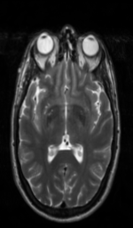
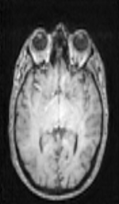

# -motion-artifacts!

SPNet output with different loss function

Test Image with artefacts in depth dataset

1) GT Image ............... 2) Depth ...................... 3) RGB 

.........

Introduce artefacts in RGB 

1).  GT Image  .............. 2)  With SSIM Loss. ............ 3)      With MSE Loss  ............. 4) With Structure Loss (Original SPNet Loss) 

 .......  ......... . ......... 

Introduce artefacts in depth

1). GT Image ...........  2) SSIM Loss ............  3) MSE Loss........... 4) Structure Loss........ 5) Perceptual Loss ...... 6) Perceptual Loss update

     

